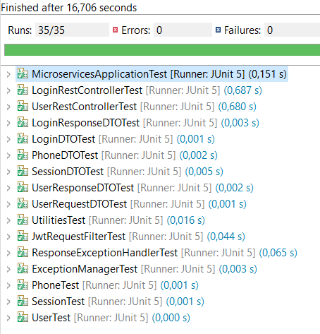

# API User Microservice

## Overview

Esta api permite la consulta, creacion, actualizacion y eliminacion de **usuarios**, las peticiones se deben autenticar con JTW.

## Pre-requirements

- JAVA 11
- Maven

## Implemented Libraries

- Spring Security
- JWT
- Lombok
- Mapstruct

* [Dependencias](#dependencies)
* [Unit Test](#test)
* [Consideraciones](#consideraciones)
* [Solution Diagram](#diagram)

## Dependencies POM

	<dependencies>
		<dependency>
			<groupId>org.springframework.boot</groupId>
			<artifactId>spring-boot-starter</artifactId>
		</dependency>

		<dependency>
			<groupId>org.springframework.boot</groupId>
			<artifactId>spring-boot-starter-test</artifactId>
			<scope>test</scope>
		</dependency>

		<dependency>
			<groupId>org.projectlombok</groupId>
			<artifactId>lombok</artifactId>
			<scope>provided</scope>
		</dependency>

		<dependency>
			<groupId>org.springframework.boot</groupId>
			<artifactId>spring-boot-starter-data-jpa</artifactId>
		</dependency>

		<dependency>
			<groupId>com.h2database</groupId>
			<artifactId>h2</artifactId>
			<scope>runtime</scope>
		</dependency>

		<dependency>
			<groupId>org.springframework.boot</groupId>
			<artifactId>spring-boot-starter-validation</artifactId>
		</dependency>

		<dependency>
			<groupId>org.springframework.boot</groupId>
			<artifactId>spring-boot-starter-web</artifactId>
			<exclusions>
				<exclusion>
					<groupId>org.springframework.boot</groupId>
					<artifactId>spring-boot-starter-tomcat</artifactId>
				</exclusion>
			</exclusions>
		</dependency>

		<dependency>
			<groupId>org.springframework.boot</groupId>
			<artifactId>spring-boot-starter-jetty</artifactId>
		</dependency>

		<dependency>
			<groupId>org.springframework.boot</groupId>
			<artifactId>spring-boot-starter-log4j2</artifactId>
		</dependency>

		<dependency>
			<groupId>org.springframework.boot</groupId>
			<artifactId>spring-boot-starter-security</artifactId>
		</dependency>

		<dependency>
			<groupId>io.jsonwebtoken</groupId>
			<artifactId>jjwt</artifactId>
			<version>0.9.1</version>
		</dependency>

		<dependency>
			<groupId>org.mapstruct</groupId>
			<artifactId>mapstruct</artifactId>
			<version>${org.mapstruct.version}</version>
		</dependency>

		<dependency>
			<groupId>org.springdoc</groupId>
			<artifactId>springdoc-openapi-ui</artifactId>
			<version>1.6.4</version>
		</dependency>
		
	</dependencies>

## Unit Tests

- Junit
- MockMvc

**Test:**

**Coverage:**

## Solution Diagram

## How to run component locally

**Microservice settings:**

- Setup Spring application using [YML file](src/main/resources), i.e. server port.

**Run:**
- `com.novo.nisum.microservices.MicroserviceApplication` main method.

**Login:**

**Config Token:**

**Save User:**

**Find User:**

## Additional notes

Desarrollado por Edwin Gonzalez  edwinhalo2y3@hotmail.com
